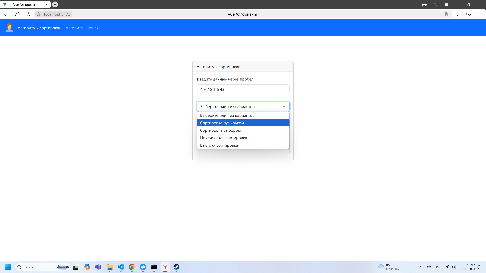
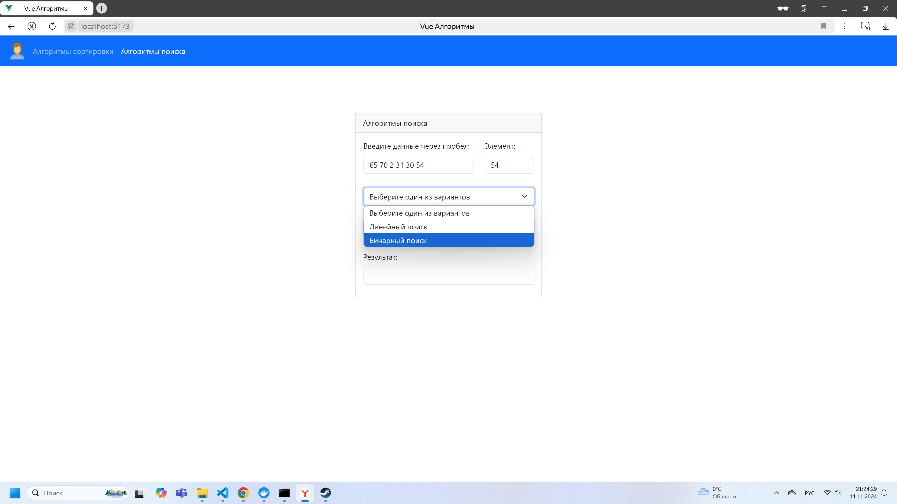
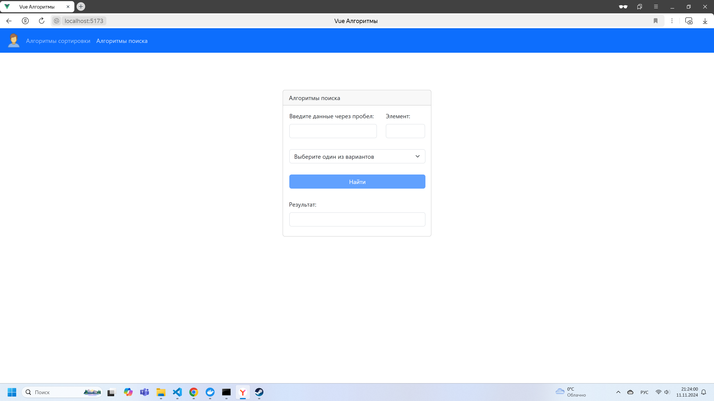
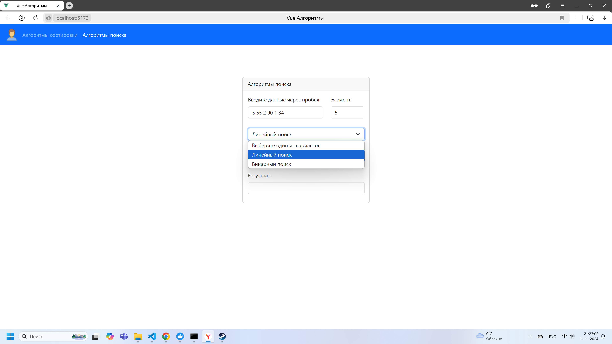
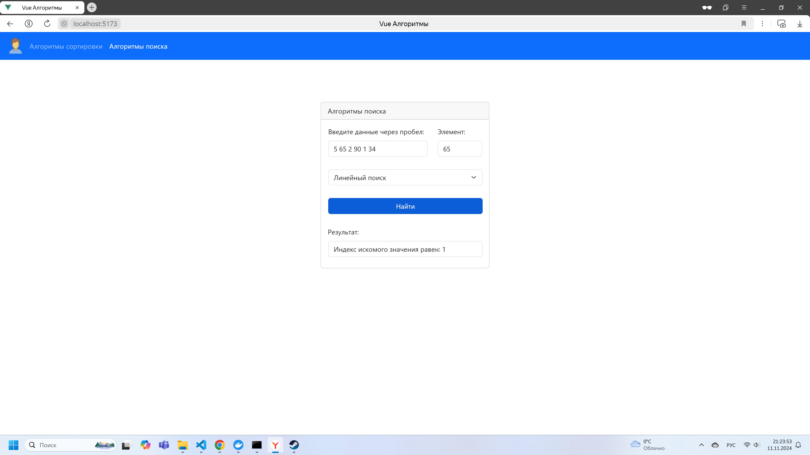
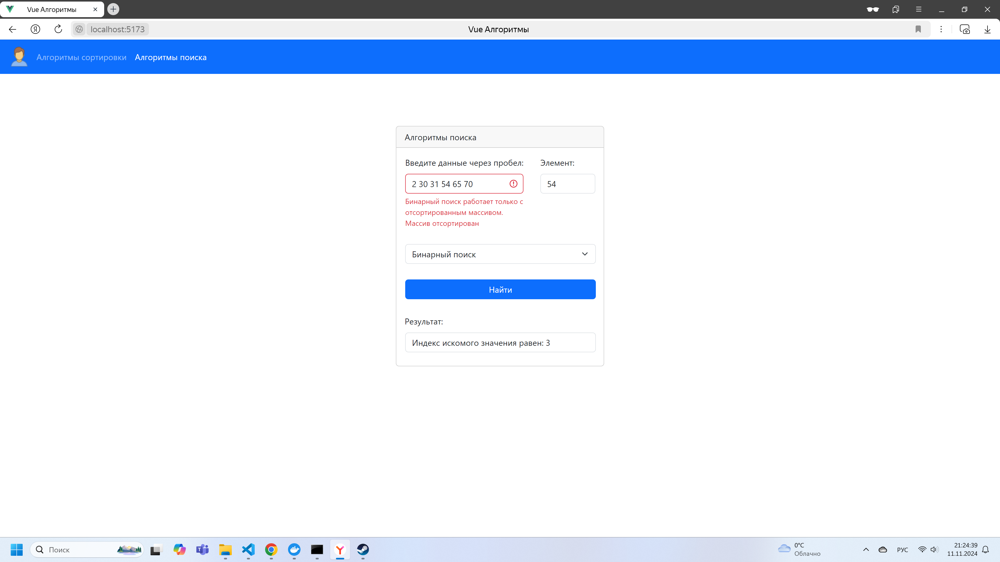

# 1. Описание проекта:

В данном проекте реализованы алгоритмы поиска и алгоритмы сортировки.  

В данном проекте можно:  

1.1. выбрать вид алгоритма: поиском или сортировкой  

1.2. ввести массив чисел, в случае поиска - ввести элемент поиска  

1.3. выбрать способ поиска/сортировки и найти/отсортировать искомый элемент/массив  

Реализованные алгоритмы сортировки:  

- сортировка пузырьком;  

- сортировка выбором;  

- циклическая сортировка;  

- быстрая сортировка.  


Реализованные алгоритмы поиска:  

- линейный поиск;  

- бинарный поиск.  

## 2. Запуск проекта:
2.1. Клонировать репозиторий

2.2. В клонированной директории выполнить команду:    

```
npm install
```

2.3. В клонированной директории выполнить команду:    

```
npm run dev
```

## 3. Доступный функционал:
В проекте 2 компонента, каждый со своим функционалом.

3.1. Компонент `SearchAlgorithm.vue` содержит разметку карточки поиска, обязательные к заполнению поля (массив чисел, заполненный через пробел и искомый элемент), а также список с алгоритмами поиска. При заполнении всех обязательных полей и нажатии на кнопку "Найти", в поле результат отображается индекс искомого элемента или "индекс не найден", в случае отсутствия искомого элемента в заданном массиве.   

3.2. Компонент `SortingAlgorithm.vue` содержит разметку карточки сортировки, обязательные к заполнению поля (массив чисел, заполненный через пробел), а также список с алгоритмами сортировки. При заполнении всех обязательных полей и нажатии на кнопку "Отсортировать", в поле результат отображается отсортированный массив.  


## 4. Скриншоты приложения  









